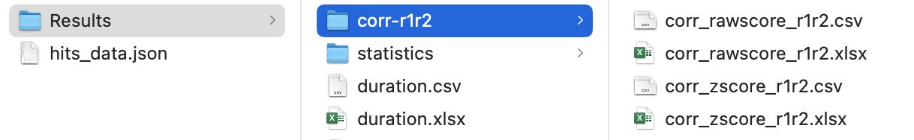

# Achieving Reliable Human Assessment of Open-Domain Dialogue Systems

Files of code and data for our [[paper](https://aclanthology.org/2022.acl-long.445/)] in ACL 2022. 

## Update:
- 2022/11/18 
  + upload code for self replication experiment
  + upload code for running our code as a tool with a simple GUI
- 2022/11/16
  + upload code for processing JSON file
  + update the description of JSON file structure for our code
- 2022/06/06
  + upload collected dialogue files

## Requirement
- Pandas
- Numpy
- SciPy
- PySimpleGUI (for GUI)

## Usage: command line
1. File `mturk_process.py` is the code for processing a normative JSON file. It puts all generated files under the generated `Results` directory in the same directory of that JSON file. 
    - To run this code, please check the examples in `01-process-all-json.sh`.
    - `Results/system_scores.xlsx` is the final $z$ score of system scores.
    - `Results/passrate.xlsx` reports the passrates in the experiment
    - `Results/duration.xlsx` reports the average duration per HIT.
    - All files generated in this step are presented as follows:
      
2. File `mturk_statistics.py` is the code for statistics such as rater agreement and significance tests. It generates `statistic/` directory under `Results/` from previous step.
    - `02-process-result-dirs.sh` provides examples of using `mturk_statistics.py`
    - `statistic/sig_test.pdf` is the figure of significance test.
    - `statistic/rater_agreement.pdf` is the rater agreement.
    - All files generated in this step are presented as follows: 
      
3. File `mturk_self_replication.py` is the code for self replication experiment. It accepted two `Results` directories of first and second experiment runs. It generates `corr-r1r2/` directory under `Results/` of first run.
    - `03-process-self-replication.sh` provides examples of using `mturk_self_replication.py`
    - All files generated in this step are presented as follows: 
      

## Usage: a tool with user interface
File `human_eval_gui.py` provides a tool with basic user interface to run our code.
  - Open GUI using
    ```
    > python run_gui.py
    ```
    
  - Process a JSON file
    
  - Process the generated 'Results/' directory
    
  - Process self-replication experiment
    
    


## Data Structure
1. Directory `data/` contains two directories: `normative_json/` and `raw_mturk_csv/`

  - `normative_json/` stores the JSON files (`hits_data.json`) that our code can process. Please convert your files to `json files` in the following structure if you would like to use our evaluation method in your own experiment.
    + `metadata`: stores the metadata for scores and models
      - ***score*** - stores scorename attributes pairs
        - ***scorename*** - the name of ratings, such as robotic and interesting in our experiment, with following attributes
          - ***positive***: bool - `false` means this score needs reversion before computing
          - ***qc***: bool - `true` means the current score will be used for quality control
          - ***max***: number - It is used for reversing scores with attribute `positive=false` by `max-original_score`. `100` in our experiment.
      - ***model***: a list of your models to be evaluated (except the quality-control model) - In our experiment, it is [biencoder, biencoder_p, kvmemnn, kvmemnn_p, lan_model, lan_model_p, polyencoder, polyencoder_p, seq2seq, seq2seq_p].
      - ***qc-model***: name of the qc (quality control) model - In our paper it is called "qc".
      - ***ranking***: `null` or a list of ranked models - If null, our code will sort models by their overall $z$ scores. Otherwise, models follow the given ranking. In our experiment, the first run is `null`, while second run and ice-breaker use the ranking from the first run.
      - ***sorted_scores***: `null` or a list of sorted scorenames (except $z$ and $raw$ scores) - If specified, our code will present scores in the order of given orders. In our paper, the order is [interesting, fun, consistent, fluent, topic, robotic, repetitive].
    + ***data***: a list of result per HIT - Each element has the following structure
      - ***result***: a list of collected data from the HIT - each element means the result of a model. In our experiment, it contains six elements: 5 competing models and a quality control model.
        - ***model***: name of current model
        - ***score***: scorenames with numerical values - For example, {robotic: 100, interesting: 37, ...}
        - ***persona***: optional - List of personas.
        - ***dialogue***: optional - Textual conversations between workers and models. Unnecessary for computing human evaluation scores. 
        - ***topic-related***: optional - Unnecessary for computing human evaluation scores. Useful for conducting meta evaluation of topics.
      - ***hit*** - HIT ID
      - ***assignment*** - Assignment ID
      - ***worker*** - Worker ID
      - ***duration in seconds*** - elapsed time of a HIT in seconds
      - ***feedback***: optional - Feedback from the worker.
  - `raw_mturk_csv/` stores the original csv files we collected from MTurk. We simply provide it as a backup.
2. Directory `dialogue_data/` stores the detailed conversations.
3. Directory `md_archives/` simply stores images which are used in this `README.md`.


## Citation
The following is the Bibtex formatted citation if you are interested in citing our work:
```
@inproceedings{ji-etal-2022-achieving,
    title = "Achieving Reliable Human Assessment of Open-Domain Dialogue Systems",
    author = "Ji, Tianbo  and
      Graham, Yvette  and
      Jones, Gareth  and
      Lyu, Chenyang  and
      Liu, Qun",
    booktitle = "Proceedings of the 60th Annual Meeting of the Association for Computational Linguistics (Volume 1: Long Papers)",
    month = may,
    year = "2022",
    address = "Dublin, Ireland",
    publisher = "Association for Computational Linguistics",
    url = "https://aclanthology.org/2022.acl-long.445",
    doi = "10.18653/v1/2022.acl-long.445",
    pages = "6416--6437",
}
```

## Notes
1. If you encounter any problems, please do not hesitate to contact me jitianbo@gmail.com
2. Let me know if you are interested in the processing codes for topic-related content, such as the wordcloud of topics. I plan to upload them later.
