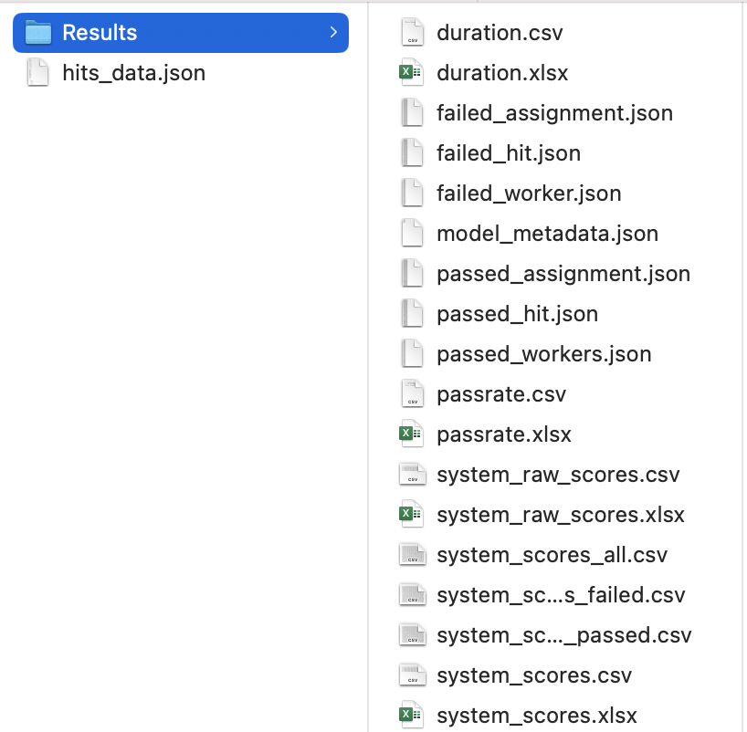

# Achieving Reliable Human Assessment of Open-Domain Dialogue Systems

Files of code and data for our [[paper](https://aclanthology.org/2022.acl-long.445/)] in ACL 2022. 

Update:
- 2022/11/16 - upload code
- 2022/06/06 - upload collected dialogue files

## Structure
1. Directory `data/` contains two directories: `normative_json/` and `raw_mturk_csv/`

  - `normative_json/` stores the json files (`hits_data.json`) that our code can process. Please convert your files to `json files` in the following structure if you would like to use our evaluation method in your own experiment.
    + `metadata`: stores the metadata for scores and models
      - `score`: stores scorename-attributes pairs
        - `scorename`: the name of ratings, such as robotic and interesting in our experiment, with following attributes
          - `positive`: bool. `false` means this score needs reversion before computing
          - `qc`: bool. `true` means the current score will be used for quality control
          - `max`: number, It is used for reversing scores with attribute `positive=false` by `max-original_score`. `100` in our experiment.
      - `model`: a list of your models to be evaluated (except the quality-control model). In our experiment, it is [biencoder, biencoder_p, kvmemnn, kvmemnn_p, lan_model, lan_model_p, polyencoder, polyencoder_p, seq2seq, seq2seq_p].
      - `qc-model`: name of the quality-control model. In our paper it is called "qc".
      - `ranking`: `null` or a list of ranked models. If null, our code will sort models by their overall $z$ scores. Otherwise, models follow the given ranking. In our experiment, the first run is `null`, while second run and ice-breaker use the ranking from the first run.
      - `sorted_scores`: `null` or a list of sorted scorenames (except $z$ and $raw$ scores). If specified, our code will present scores in the order of given orders. In our paper, the order is [interesting, fun, consistent, fluent, topic, robotic, repetitive].
    + `data`: a list of result per HIT, of which each element is as follows:
      - `result`: a list of collected data from the HIT, each element means the result of a model. In our experiment, it contains six elements: 5 competing models and a quality control model.
        - `model`: name of an evaluated model
        - `score`: scorenames with  numerical values. For example, {robotic: 100, interesting: 37, ...}
        - `persona`: optional. List of personas.
        - `dialogue`: optional. Conversations between workers and models. It is not necessary since our code only handles rating scores. 
        - `topic-related`: optional. It can be used to conduct meta evaluation of topics, but it is currently unnecessary.
      - `hit`: HIT ID
      - `assignment`: Assignment ID
      - `worker`: WorkerID
      - `duration in seconds`: elapsed time of a HIT in seconds
      - `feedback`: optional. Feedback from the worker.
  - `raw_mturk_csv/` stores the original csv files we collected from MTurk. We simply provide it as a backup.
2. Directory `dialogue_data/` stores the detailed conversations.
3. Directory `md_archives/` simply stores images which are used in this `README.md`.

## Code
1. `mturk_process.py` is the code for processing a normative json file. It will put all generated files in the `Results` directory in the same directory of that json file. It looks like: 
    - `01-process-all-json.sh` provides examples of using `mturk_process.py`
    - `Results/system_scores.xlsx` is the final $z$ score of system scores.
    - `Results/passrate.xlsx` reports the passrates in the experiment
    - `Results/duration.xlsx` reports the average duration per HIT.
2. `mturk_statistics.py` is the code for statistics such as rater agreement and significance tests. It generates `statistic/` directory under `Results/` from previous step, as: 
    - `02-process-result-dirs.sh` provides examples of using `mturk_statistics.py`
    - `statistic/sig_test.pdf` is the figure of significance test.
    - `statistic/rater_agreement.pdf` is the rater agreement.


## Citation
The following is the Bibtex formatted citation if you are interested in citing our work:
```
@inproceedings{ji-etal-2022-achieving,
    title = "Achieving Reliable Human Assessment of Open-Domain Dialogue Systems",
    author = "Ji, Tianbo  and
      Graham, Yvette  and
      Jones, Gareth  and
      Lyu, Chenyang  and
      Liu, Qun",
    booktitle = "Proceedings of the 60th Annual Meeting of the Association for Computational Linguistics (Volume 1: Long Papers)",
    month = may,
    year = "2022",
    address = "Dublin, Ireland",
    publisher = "Association for Computational Linguistics",
    url = "https://aclanthology.org/2022.acl-long.445",
    doi = "10.18653/v1/2022.acl-long.445",
    pages = "6416--6437",
}
```

## Notes
1. If you encounter any problems, please do not hesitate to contact me jitianbo@gmail.com
2. Let me know if you are interested in the processing codes for topic-related content, such as the wordcloud of topics. I plan to upload them later.
